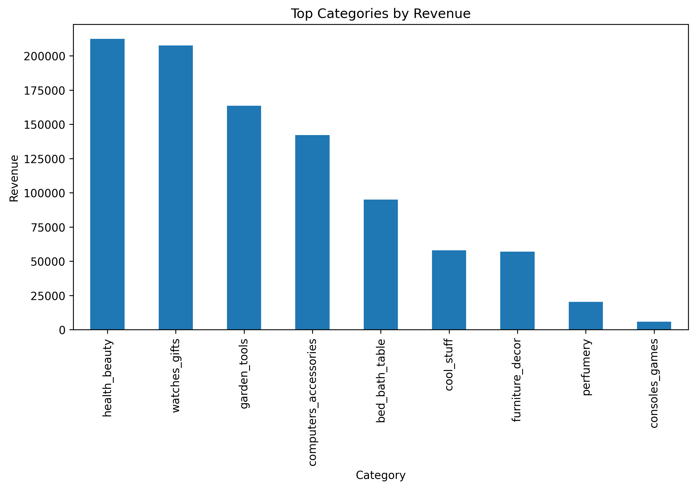
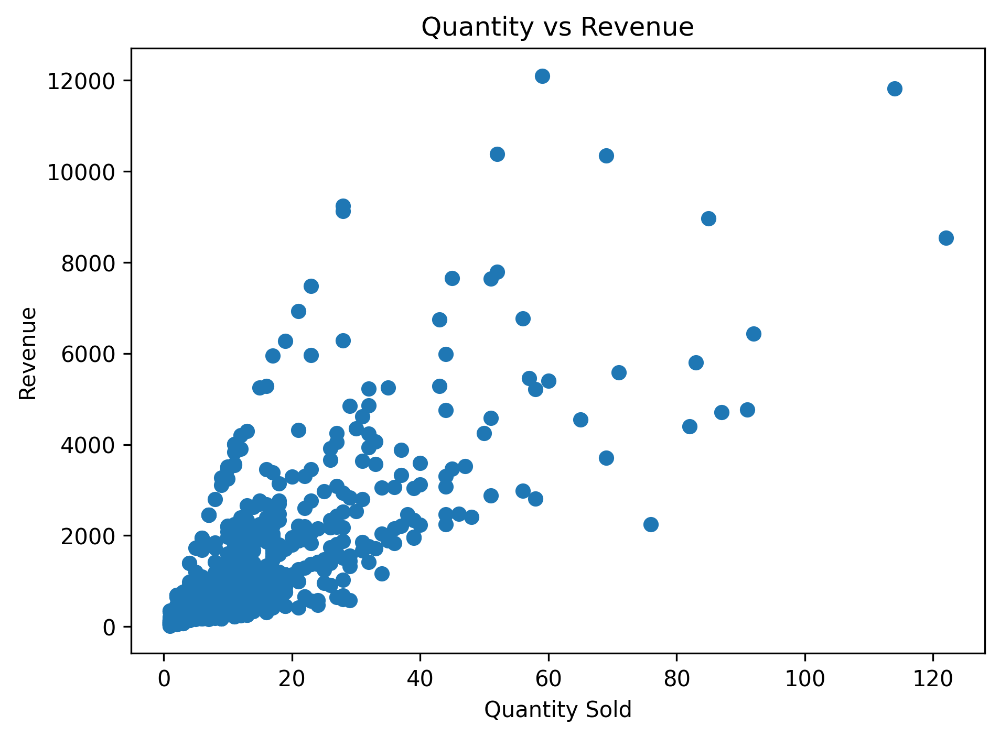
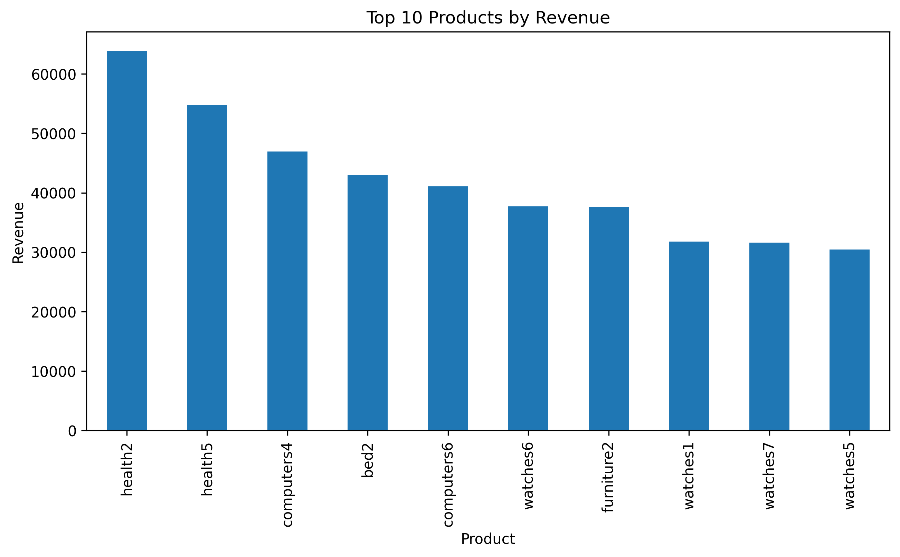
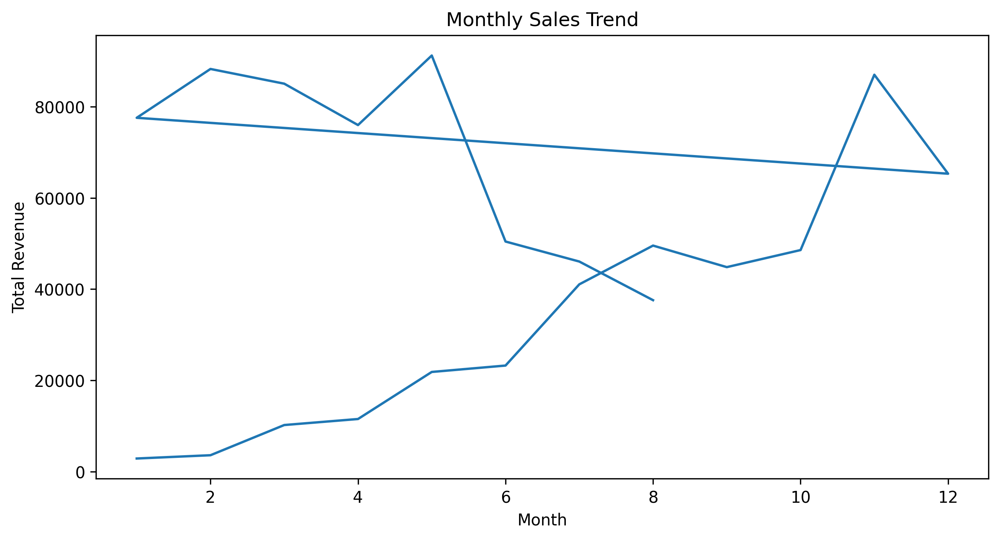

# 📊 Retail Sales Data Analysis Project

<div align="center">


*An end-to-end retail sales data analysis project delivering actionable business insights*

[Overview](#-overview) • [Features](#-key-features) • [Visualizations](#-visualizations) • [Installation](#-installation) • [Usage](#-usage) • [Insights](#-key-insights)

</div>

---

## 📋 Overview

This project presents a comprehensive analysis of retail sales data, transforming raw transactional data into actionable business insights. Using Python and modern data analysis techniques, the project explores sales trends, product performance, and cost optimization opportunities to support data-driven decision-making.

**Data Source:** Kaggle  
**Domain:** Retail & E-commerce  
**Focus Areas:** Revenue Analysis, Product Performance, Cost Optimization

---

## 🎯 Objectives

- 📈 **Analyze monthly sales trends** to identify seasonal patterns
- 🏆 **Identify top-performing products** and categories
- 💰 **Understand category-wise revenue contribution** for strategic planning
- 🔍 **Explore relationships** between quantity sold and revenue generated
- 📦 **Evaluate freight cost impact** on overall profitability

---

## 🛠️ Tools & Technologies

| Tool | Purpose |
|------|---------|
| **Python 3.8+** | Core programming language |
| **Pandas** | Data cleaning, manipulation, and analysis |
| **Matplotlib** | Data visualization and charting |
| **Jupyter Notebook** | Interactive development environment |

---

## 🧹 Data Cleaning & Preparation

The data preprocessing pipeline includes:

- ✅ Selection of relevant columns for focused analysis
- ✅ Column renaming for improved clarity and consistency
- ✅ DateTime conversion for temporal analysis
- ✅ Feature engineering (Month, Year extraction)
- ✅ Profit calculation: `Profit = Revenue - Freight Cost`

---

## 📊 Visualizations

### 1️⃣ Revenue by Category


**Insight:** Identifies which product categories drive the most revenue, enabling focused inventory management and marketing strategies.

---

### 2️⃣ Revenue by Quantity


**Insight:** Reveals the correlation between sales volume and revenue generation, helping optimize pricing and discount strategies.

---

### 3️⃣ Top 10 Products by Revenue


**Insight:** Highlights star products that deserve prioritized stock management and promotional focus.

---

### 4️⃣ Monthly Revenue Trend


**Insight:** Uncovers seasonal trends and peak sales periods for better demand forecasting and resource allocation.

---

## 💡 Key Insights

| Finding | Business Impact |
|---------|----------------|
| 📦 **Freight Cost Impact** | Significant effect on profit margins—logistics optimization can boost profitability |
| 📅 **Seasonal Patterns** | Clear monthly revenue fluctuations indicate demand cycles |
| 🎯 **Category Performance** | Top categories contribute disproportionately to total revenue |
| 📈 **Growth Opportunities** | Underperforming months present opportunities for targeted campaigns |

---

## 💼 Business Value

This analysis empowers businesses to:

- 🎯 Make **data-driven pricing decisions** based on revenue patterns
- 📦 Focus on **high-revenue products** for inventory optimization
- 🚚 Optimize **logistics and freight costs** to improve margins
- 📅 Identify **seasonal sales opportunities** for strategic planning
- 📊 Support **executive decision-making** with visual insights

---

## 🚀 Installation

```bash
# Clone the repository
git clone https://github.com/yourusername/retail-sales-analysis.git

# Navigate to project directory
cd retail-sales-analysis

# Install required packages
pip install -r requirements.txt
```

### Requirements
```
pandas>=1.3.0
matplotlib>=3.4.0
jupyter>=1.0.0
numpy>=1.21.0
```

---

## 📖 Usage

```bash
# Launch Jupyter Notebook
jupyter notebook

# Open the analysis notebook
# Navigate to: notebooks/retail_analysis.ipynb
```

---

## 🔮 Future Enhancements

- [ ] 📊 **Interactive Power BI Dashboard** for real-time insights
- [ ] 👥 **Customer Segmentation Analysis** using clustering algorithms
- [ ] 💹 **Profit Margin Analysis** by category and product
- [ ] 🤖 **Predictive Sales Forecasting** with machine learning models
- [ ] 🌍 **Geographic Analysis** if location data becomes available

---

## 📁 Project Structure

```
retail-sales-analysis/
│
├── data/                   # Raw and processed datasets
├── notebooks/              # Jupyter notebooks with analysis
├── visuals/               # Generated charts and graphs
├── README.md              # Project documentation
└── requirements.txt       # Python dependencies
```

---

## 👨‍💻 Author

**Huzaifa Mujahid**  
Data Analysis & Data Science Student

[](https://linkedin.com/in/huzaifa-mujahid-17870639b)
---

## 🌟 Acknowledgments

- Dataset sourced from [Kaggle](https://www.kaggle.com/)
- Inspired by real-world retail analytics challenges
- Built with ❤️ for the data community

---

## 📜 License

This project is licensed under the MIT License - see the [LICENSE](LICENSE) file for details.

---

<div align="center">

### ⭐ If you find this project helpful, please consider giving it a star!

**Made with 💻 and ☕ by Huzaifa Mujahid**

</div>
